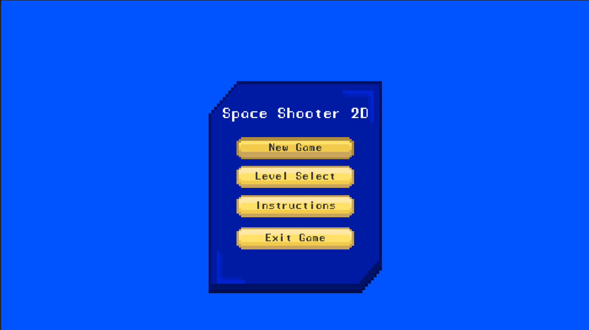
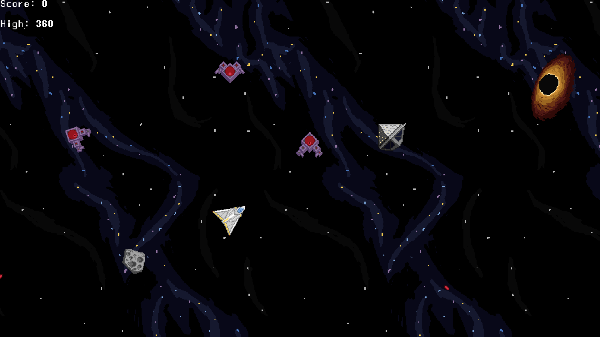
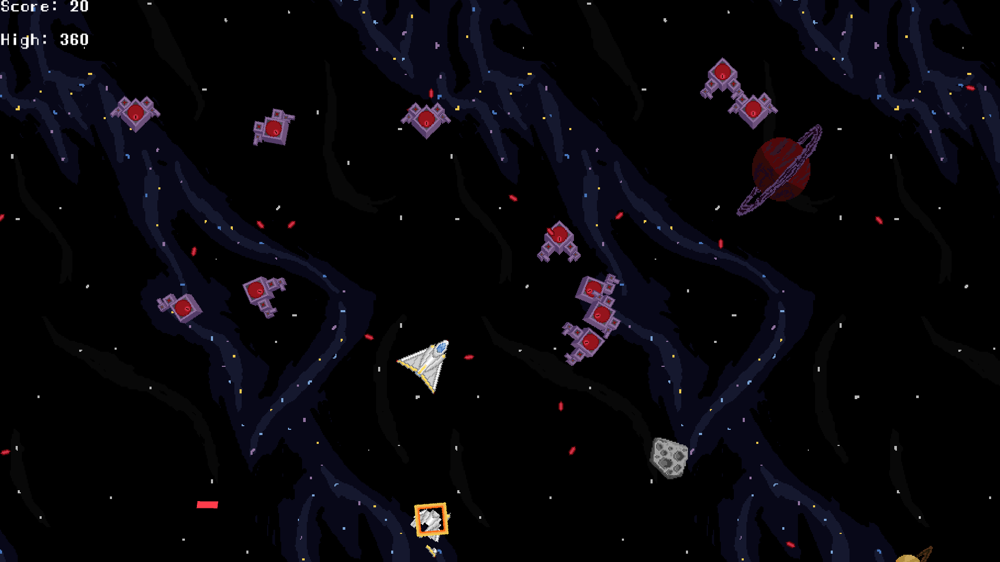
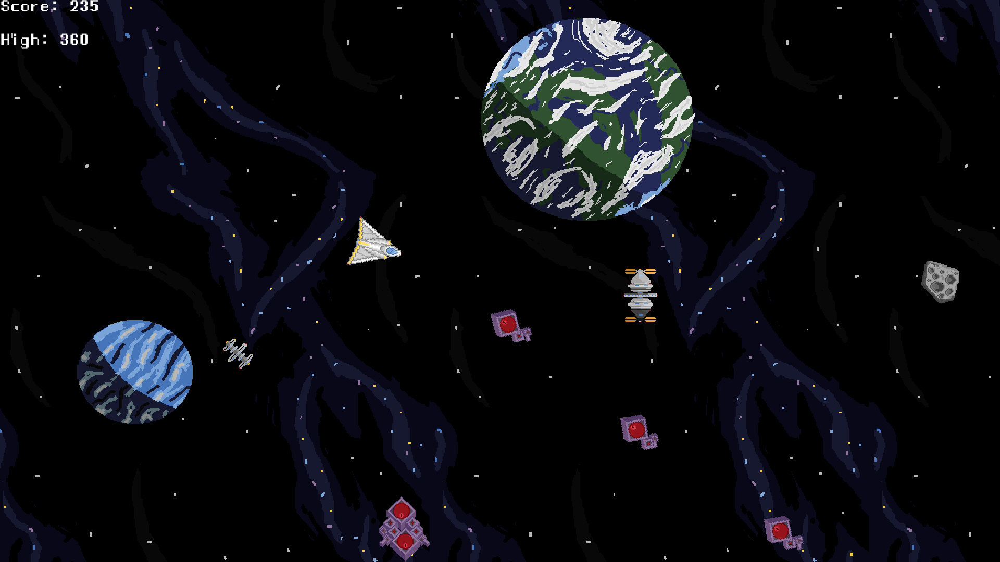
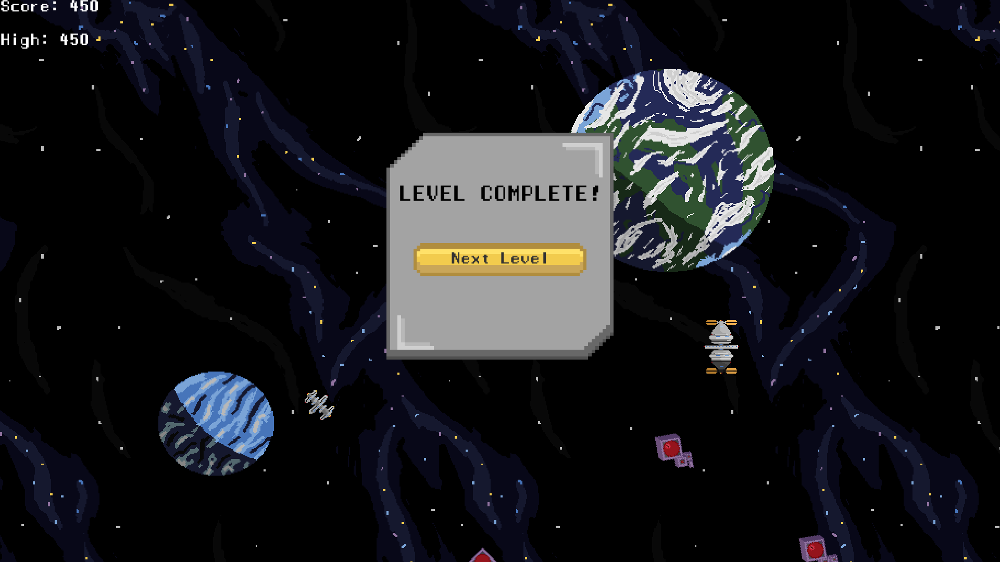

# 2D-Shooter

A 2D space shooter game built with Unity. Defeat all the invaders and protect the galaxy to bring back peace!

## Features

- 3 levels
- Multiple enemy types (chaser, diagonal shooter, straight shooter)
- Asteroids, black holes, and space stations
- Sound effects

## Controls

- **WASD** - Move
- **Esc** - Pause

## Screenshots

## Builds

| Platform | Location |
| -------- | -------- |
| Windows | [`Preview the Game/WindowsBuild.zip`](Preview%20the%20Game/WindowsBuild.zip) |
| macOS | [`Preview the Game/MacBuild.zip`](Preview%20the%20Game/MacBuild.zip) |
| WebGL | [`Preview the Game/WebGLBuild.zip`](Preview%20the%20Game/WebGLBuild.zip) |

Play the WebGL build online at <https://hardik-pandey.com/2D-Shooter/>

Also available free on itch.io - donations appreciated! <https://hardik-7892.itch.io/space-shooter-2d>
